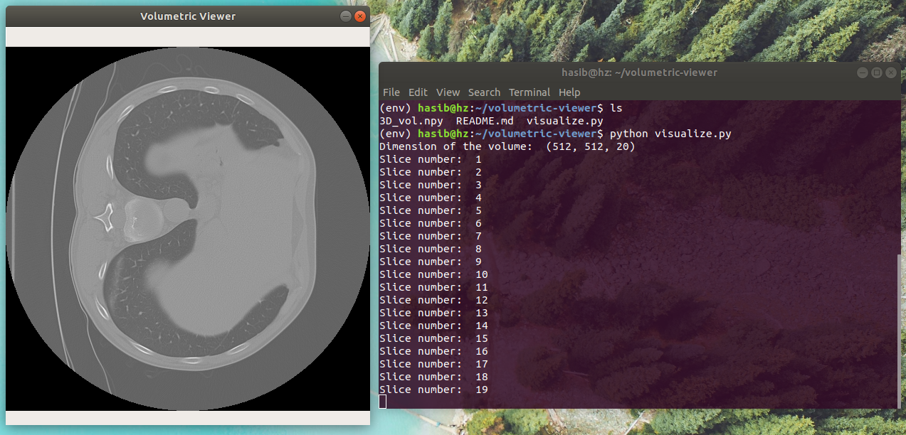

# volumetric-viewer
Volumetric Viewer: A simple interactive viewer of volumetric data in sequence of slice images. The interaction is performed by keyboard buttons.

A pythonic clone of MATLAB's utility function - [3D slice viewer](https://www.mathworks.com/matlabcentral/fileexchange/66672-volume-slice-browser-3d-slice-viewer). Add some cherry to your 3D expoloratory data analysis.

# Requirements
* cv2
* numpy

Tested on Ubuntu 18.04 with Python 3.6.

# Usage
Just clone and run ```visualize.py```

Demo uses a 3D CT Image data with depth of 20. Use 'W' and 'S' to toggle between slices. Had to sample subset of slices as the entire volume crosses 100MB space which Github does not allow uploading! :( 

<p align="center">
  <a href="#"></a>
</p>


# Credits
Me and only me.
